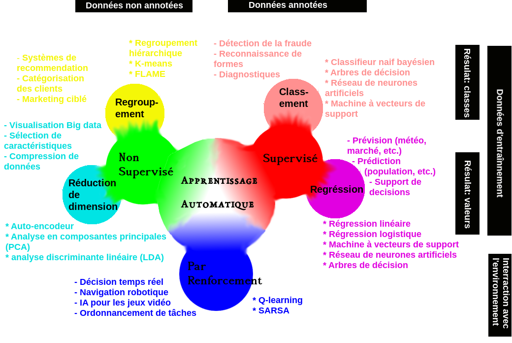
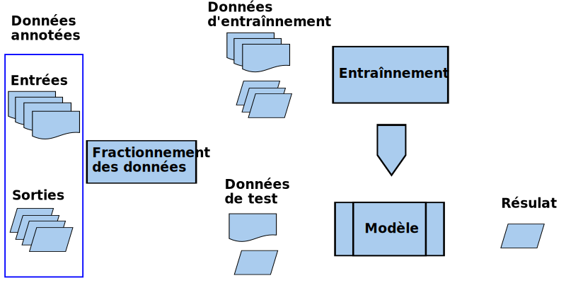
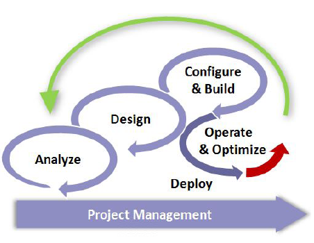

# Introduction à l'apprentissage automatique

## Sommaire

- [Chapitre I: Introduction](#chapitre-i-introduction)
- [Chapitre II: Préparation de données](#chapitre-ii-préparation-de-données)
- [Chapitre III: Classification naïve bayésienne](#chapitre-iii-classification-naïve-bayésienne)
- [Chapitre IV: Machine à vecteurs de support](#chapitre-iv-machine-à-vecteurs-de-support)
- [Chapitre V: Arbre de décision](#chapitre-v-arbre-de-décision)
- [Chapitre VI: Régression linéaire](#chapitre-vi-régression-linéaire)
- [Chapitre VII: Régression logistique](#chapitre-vii-régression-logistique)
- [Chapitre VIII: Perceptron](#chapitre-viii-perceptron)
- [Chapitre IX: Réseau de neurones artificiels](#chapitre-ix-réseau-de-neurones-artificiels)
- [Chapitre X: Regroupement K-Means](#chapitre-x-regroupement-k-means)
- [Chapitre XI: Auto-encodeur](#chapitre-xi*auto-encodeur)
- [Chapitre XII: Apprentissage par renforcement](#chapitre-xii-apprentissage-par-renforcement)

## Glossaire

- **caractéristique** [feature] Dans une base  de donnée, c'est l'équivalent de "attribut"
- **échantillon** [sample] Dans une base de données, c'est l'équivalent de "enregistrement"
- **entraînement** [training]

## Chapitre I: Introduction

|  |
|:--:|
| *Apprentissage automatique* |

### I-1 Motivation

- Certaines tâches sont difficiles à programmer manuellement: Reconnaissance de formes, Traduction par machine, Reconnaissance de la parole, Aide à la décision, etc.
- Les données sont disponibles, qui peuvent être utilisé pour estimer la fonction de notre tâche.

### I-2 Applications

- Santé:
  - Watson santé de IBM: https://www.ibm.com/watson/health/
  - Projet Hanover de Microsoft: https://hanover.azurewebsites.net
  - DeepMind santé de Google: https://deepmind.com/applied/deepmind-health/

- Finance : Prévention de fraude, management de risques, prédiction des investissements, etc.
- Domaine légal : cas de CaseText https://casetext.com
- Traduction: Google traslate https://translate.google.com/
**_...TODO: Add more_**

### I-3 Types des algorithmes d'apprentissage

#### I-3-1 Apprentissage supervisé

Lorsque nous disposons d'un ensemble de données avec les résulats attendus, on peut entraîner un système sur ces données pour inférer la fonction utilisée pour avoir ces résulats.
En résumé:

- **Source d'apprentissage:** des données annotées (nous avons les résultats attendus)
- **Retour d'information:** direct; à partir des résulats attendues.
- **Fonction:** prédire les future résultats

|  |
|:--:|
| *Apprentissage supervisé* |

Selon le type d'annotation, on peut remarquer deux types des algorithmes d'apprentissage automatique: classement et régression.

##### Classement (Classification supervisée)

Lorsque le résulat attendu est une classe (groupe).

| Par exemple: |
| :--: |
| Classer un animal comme: chat, chien, vache ou autre en se basant sur le poids, la longueur et le type de nourriture.  |

##### Régression

Lorsque le résulat attendu est une valeur.

| Par exemple: |
| :--: |
| Estimer le prix d'une maison à partir de sa surface, nombre de chambre et l'emplacement. |

#### I-3-2 Apprentissage non supervisé

Lorsque nous disposons d'un ensemble de données non annotées (sans savoir les résulats attendus).
En résumé:

- **Source d'apprentissage:** des données non annotées
- **Retour d'information:** pas de retour; on dispose seulement des données en entrée.
- **Fonction:** rechercher les structures cachées dans les données.

Selon le type de structure que l'algorithme va découvrir, on peut avoir: le regroupement et la réduction de dimension.

##### Clustering (Regroupement)

L'algorithme de regroupement sert à assigner les échantillons similaires dans le même groupe.
Donc, le résulat est un ensemble de groupes contenants les échantillons

| Par exemple: |
| :--: |
| Regrouper les plantes similaires en se basant sur la couleur, la taile, etc.  |

##### Réduction de dimension

L'algorithme de réduction de dimension a comme but d'apprendre comment représenter des données en entrée avec moins de valeurs.

| Par exemple: |
| :--: |
| Représenter des individus sur un graph de deux dimensions en utilisant la taille, le poids, l'age, la couleur des cheveux, la texture des cheveux et la couleur des yeux  |

#### I-3-3 Apprentissage par renforcement

- **Source d'apprentissage:** le processus de décision
- **Retour d'information:** un système de récompense
- **Fonction:** recherche des structures cachées dans les données.

|  |
|:--:|
| *Apprentissage par renforcement [ [Wikimedia](https://commons.wikimedia.org/wiki/File:Reinforcement_learning_diagram_fr.svg?uselang=fr) ]* |

### I-4 Limites de l'apprentissage automatique

- Pour des tâches complexes, on a besoin d'une grande quantité de données
- Dans le cas de l'apprentissage supervisé, l'annotation de données est une tâche fastidieuse; qui prend beaucoup de temps.
- Le traitement automatique de langages narurels (TALN) reste un défit
- Les données d'entraînement sont souvent biaisées

### I-5 Outils de l'apprentissage automatique

#### frameworks et bibliothèque logicielles

##### Deep Learning

L'algorithme d'apprentissage est le réseau de neurones:

| Outil | Licence | écrit en | interfaces |
| :---: | :---: | :---: | :---: |
| [Keras](https://keras.io) | - | Python | Python, R |
| [Theano](http://deeplearning.net/software/theano/) | - | Python | Python |
| [Caffe](http://caffe.berkeleyvision.org) | BSD | C++ | C++, MATLAB, Python |
| [Torch](http://torch.ch) | BSD | C, Lua | C, Lua, LuaJIT |
| [The Microsoft Cognitive Toolkit](https://www.microsoft.com/en-us/cognitive-toolkit/) | MIT | C++ | Python, C++ |
| [Deeplearning4j]() | Apache 2.0 | C++, Java | Java, Scala, Clojure, Python, Kotlin |

##### Générique

| Outil | Licence | écrit en | interfaces |
| :---: | :---: | :---: | :---: |
| [Shogun](http://www.shogun-toolbox.org) | - | C++ | C++, C#, Java, Lua, Octave, Python, R, Ruby |
| [scikit-learn](https://scikit-learn.org/stable/) | BSD | Python | Python |
| [Apache Spark MLLib](http://spark.apache.org/mllib/) | Apache 2.0 | - | Java, R, Python, Scala |
| [ScalaNLP Breeze](https://github.com/scalanlp/breeze) | Apache 2.0 | Scala | Scala |

#### Apprentissage automatique comme un service

Apprentissage automatique comme un service (MLaaS: Machine Learning as a Service):
- [Amazon Machine Learning](https://aws.amazon.com/aml/)
- [BigML](https://bigml.com)
- [DataRobot](https://www.datarobot.com)
- [Deepai enterprise machine learning](https://deepai.org/enterprise-machine-learning)
- [Deepcognition](https://deepcognition.ai)
- [IBM Watson Machine Learning](https://www.ibm.com/cloud/machine-learning)
- [Google Cloud Machine Learning Engine](https://cloud.google.com/ml-engine/)
- [Microsoft Azure Machine Learning studio](https://azure.microsoft.com/fr-fr/services/machine-learning-studio/)
- [MLJAR](https://mljar.com)
- [Open ML](https://www.openml.org)
- [ParallelDots](https://www.paralleldots.com)
- [VALOHAI](https://valohai.com)
- [Vize](https://vize.ai): Traitement d'images

### ANNEXE: Méthodologies de science des données

#### CRISP-DM (Cross-industry standard process for data mining) [Standard ouvert]

|  |
|:--:|
| *CRISP-DM [ [Wikimedia](https://commons.wikimedia.org/wiki/File:CRISP-DM_Process_Diagram.png) ]* |

#### ASUM-DM (Analytics Solutions Unified Method for Data Mining) [IBM]

|  |
|:--:|
| *ASUM-DM [ [Source](ftp://ftp.software.ibm.com/software/data/sw-library/services/ASUM.pdf) ]* |

#### TDSP (Team Data Science Process) [Microsoft]

|  |
|:--:|
| *TDSP [ [Source](https://docs.microsoft.com/fr-fr/azure/machine-learning/team-data-science-process/overview) ]* |

### Bibliographie

- https://www.kdnuggets.com/2017/11/3-different-types-machine-learning.html
- https://www.techleer.com/articles/203-machine-learning-algorithm-backbone-of-emerging-technologies/
- https://www.wired.com/story/greedy-brittle-opaque-and-shallow-the-downsides-to-deep-learning/
- https://data-flair.training/blogs/advantages-and-disadvantages-of-machine-learning/
- https://towardsdatascience.com/coding-deep-learning-for-beginners-types-of-machine-learning-b9e651e1ed9d
- https://towardsdatascience.com/selecting-the-best-machine-learning-algorithm-for-your-regression-problem-20c330bad4ef
- https://docs.microsoft.com/fr-fr/azure/machine-learning/team-data-science-process/overview
- https://www.ibm.com/support/knowledgecenter/en/SSEPGG_9.5.0/com.ibm.im.easy.doc/c_dm_process.html
- ftp://public.dhe.ibm.com/software/analytics/spss/documentation/modeler/18.0/en/ModelerCRISPDM.pdf

## Chapitre II: Préparation des données

**_...TODO: Complete one day!!_**

### II-1 Collection des données

#### Qualité des données

Critères d’intégrité des données:
- Taille: Nombre des échantillons (enregistrements). Certaines tâches nécessitent une grande taille de données pour qu'elles soient appris.
- Le nombre et le type de caractéristiques (nominales, binaires, ordinales ou continues).
- Le nombre des erreurs d'annotation
- La quantité de bruits dans les données: erreurs et exceptions

Les problèmes rencontrés dans les données:

- Valeurs omises (données non disponibles): des échantilons (enregistrements) avec des caractéristiques (attributs) sans valeurs. Les causes, entre autres, peuvent être:
  - Mauvais fonctionnement de l'équipement
  - Incohérences avec d'autres données et donc supprimées
  - Non saisies car non (ou mal) comprises
  - Considérées peu importantes au moment de la saisie

- Échantillons dupliqués

- Des mauvaises annotations. Par exemple, un annotateur humain marque un échantillon comme "chat" or l'étiquette correcte est "chien".
  - Incohérence dans les conventions de nommage

- Bruit dans les données. Parmi ces causes:
  - Instrument de mesure défectueux
  - Problème de saisie
  - Problème de transmission

Pour régler ces problèmes:
- Valeurs omises:
  - Suppression
  - Saisie manuelle
  - Remplacement par une constante globale. Par exemple, "inconnu" pour les valeurs nominales ou "0" pour les valeurs numériques.
  - Remplacement par la moyenne dans le cas des valeurs numériques, en préférence de la même classe.
  - Remplacement par la valeur la plus fréquente dans le cas des valeurs nominales.
  - Remplacement par la valeur la plus probable.
- Échantillons dupliqués
  - Suppression
- Bruit (erreur ou variance aléatoire d'une variable mesurée):
  - Binning ou Bucketing (groupement des données par classe). Consulter "Transformation des données".
  - Clustering pour détecter les exceptions
  - Détection automatique des valeurs suspectes et vérification humaine.
  - Lisser les données par des méthodes de régression.

#### Intégration des données

#### Échantillonnage et partitionnement des données

### II-3 Transformation des données

### II-4 Réduction des données

### II-5 Discrétisation des données

### Bibliographie

- https://developers.google.com/machine-learning/data-prep/
- https://developers.google.com/machine-learning/crash-course/representation/video-lecture
- https://machinelearningmastery.com/how-to-prepare-data-for-machine-learning/
- https://www.altexsoft.com/blog/datascience/preparing-your-dataset-for-machine-learning-8-basic-techniques-that-make-your-data-better/
- https://www.analyticsindiamag.com/get-started-preparing-data-machine-learning/
- https://docs.microsoft.com/fr-fr/azure/machine-learning/team-data-science-process/prepare-data

[vec-f]: https://latex.codecogs.com/png.latex?\overrightarrow{f}
[c-i]: https://latex.codecogs.com/png.latex?c_i
[f-j]: https://latex.codecogs.com/png.latex?f_j
[vec-C]: https://latex.codecogs.com/png.latex?\overrightarrow{C}

## Chapitre III: Classification naïve bayésienne

### III-1 Classification

Voici le théorème de Bayes:

![III-1-bayes]

Le problème de classification revient à estimer la probabilité de chaque classe ![c-i] sachant un vecteur de caractéristiques ![vec-f].
Par exemple, on veut estimer la probabilité d'un animal étant: un chien, un chat, une vache ou autre (4 classes) en utilsant quelques caractéristiques: poids, longueur, longueur des pattes et le type de nourriture.
En appliquant le théorème de Bayes:

![III-1-bayes2]

Le dénominateur ne dépend pas de la classe ![c-i]

![III-1-bayes3]

En supposant l'indépendance entre les critères ![f-j] de ![vec-f] (d'où le nom: naïve):

![III-1-bayes4]

Les probabilités calculées servent à sélectionner la classe la plus probable sachant un vecteur de caractéristiques donné.
Donc, la classe estimée (*c* ) est celle qui maximise la probabilité conditionnelle.

![III-1-bayes5]

![III-1-bayes6]

Techniquement, on utilise l'espace logarithmique puisque le produit des probabilités converge vers zéro.

![III-1-bayes7]

[III-1-bayes]: https://latex.codecogs.com/png.latex?\overbrace{P(A|B)}^{\text{post\'erieure}}=\frac{\overbrace{P(A)}^{\text{ant\'erieure}}\overbrace{P(B|A)}^{\text{vraisemblance}}}{\underbrace{P(B)}_{\text{\'evidence}}}
[III-1-bayes2]: https://latex.codecogs.com/png.latex?P(c_i|\overrightarrow{f})=\frac{P(c_i)P(\overrightarrow{f}|c_i)}{P(\overrightarrow{f})}
[III-1-bayes3]: https://latex.codecogs.com/png.latex?P(c_i|\overrightarrow{f})&space;\propto&space;P(\overrightarrow{f}|c_i)&space;P(c_i)
[III-1-bayes4]: https://latex.codecogs.com/png.latex?P(c_i|\overrightarrow{f})&space;\propto&space;P(c_i)&space;\prod\limits_{f_j&space;\in&space;\overrightarrow{f}}&space;P(f_j|c_i)
[III-1-bayes5]: https://latex.codecogs.com/png.latex?c&space;=&space;\arg\max\limits_{ci}&space;P(c_i|\overrightarrow{f})
[III-1-bayes6]: https://latex.codecogs.com/png.latex?c&space;=&space;\arg\max\limits_{ci}&space;P(c_i)&space;\prod\limits_{f_j&space;\in&space;\overrightarrow{f}}&space;P(f_j|c_i)
[III-1-bayes7]: https://latex.codecogs.com/png.latex?c=\arg\max\limits_{ci}\;\log(P(c_i))+\sum\limits_{f_j\in\overrightarrow{f}}\log(P(f_j|c_i))

### III-2 Apprentissage

Étant donné un ensemble de données d'entraînement avec *N* échantillons, la probabilité d'apparition d'une classe ![c-i] est estimée comme étant le nombre de ses échantillons divisé par le nombre total des échantillons d'entraînement.

![III-2-pci]

La probabilité de chaque caractéristique ![f-j] sachant une classe ![c-i] est estimée selon le type de ces valeurs: discrètes, binaires ou continues.

#### Loi multinomiale

Lorsque les valeurs des caractéristiques sont discrètes, on utilise la loi multinomiale.
Par exemple, la couleur des cheveux avec les valeurs: brun, auburn, châtain, roux, blond vénitien, blond et blanc.
La probabilité d'une caractéristique ![f-j] sachant une classe ![c-i] est le nombre des occurrences de ce critère dans la classe  ( ![III-2-mult1] ) divisé par le nombre de ces occurrences dans tout l'ensemble de données.

![III-2-mult2]

Certaines caractéristiques peuvent ne pas se figurer dans une classe donnée, ce qui va donner une probabilité nulle.
Pour remedier à ce problème, on peut utiliser une fonction de lissage comme le lissage de Lidstone.

![III-2-mult3]

Où: |![vec-f]| est le nombre des caractéristiques.
Alpha: est un nombre dans l'intervalle ]0, 1]. Lorsque sa valeur égale à 1, on appelle ça le laaissage de Laplace.

#### Loi de Bernoulli

Lorsque les valeurs des caractéristiques sont binaires, on utilise la loi de Bernoulli.
Par exemple,

**_...TODO: Complete one day!!_**

#### Loi normal

Lorsque les valeurs des caractéristiques sont continues, on utilise la loi normale (loi gaussienne).
Par exemple, le poids, le prix, etc.
En se basant sur les données d'entraînement avec *N* échantillons, on calcule l'espérance *μ* et la variance *σ²* de chaque caractéristique ![f-j] et chaque classe ![c-i].

![III-2-mu]

![III-2-sigma]

Donc, la probabilité qu'une caractéristique ![f-j] ait une valeur *x* sachant une classe ![c-i] suit la loi normale.

![III-2-normal]

[III-2-pci]: https://latex.codecogs.com/png.latex?P(c_i)&space;=&space;\frac{|c_i|}{N}
[III-2-mult1]: https://latex.codecogs.com/png.latex?|c_i|_{f_j}
[III-2-mult2]: https://latex.codecogs.com/png.latex?P(f_j|c_i)&space;=&space;\frac{|c_i|_{f_j}}{\sum_{c_j}&space;|c_j|_{f_j}}
[III-2-mult3]: https://latex.codecogs.com/png.latex?P(f_j|c_i)&space;=&space;\frac{|c_i|_{f_j}+\alpha}{\sum_{c_j}&space;|c_j|_{f_j}+\alpha|\overrightarrow{f}|}
[III-2-mu]: https://latex.codecogs.com/png.latex?\mu_{ij}=\frac{1}{|c_i|}\sum\limits_{k=1}^{|c_i|}x_k\;/\;x_k\;\in\;f_j\,\cap\,c_i
[III-2-sigma]: https://latex.codecogs.com/png.latex?\sigma^2_{ij}=\frac{1}{|c_i|-1}\sum\limits_{k=1}^{|c_i|}(x_k-\mu_{ij})^2\;/\;x_k\;\in\;f_j\,\cap\,c_i
[III-2-normal]: https://latex.codecogs.com/png.latex?P(f_j=x|c_i)=\frac{1}{2\pi\sigma^2_{ij}}e^{-\frac{(x-\mu_{ij})^2}{2\sigma^2_{ij}}}

### III-3 Exemple

#### Classifieur naïf bayésien suivant la loi normal

Empruntons l'exemple de [Wikipédia](https://fr.wikipedia.org/wiki/Classification_naïve_bayésienne#Classification_des_sexes)

On veut classer une personne donnée en féminin ou masculin selon la taille, le poids et la pointure.
Donc, le vecteur de caractéristique ![vec-f]={taille, poids, pointure} et le vecteur de classes ![vec-c]={féminin, masculin}.
Les données d'apprentissage contiennent 8 échantillons.

| Sexe | Taille (cm) | Poids (kg) |	Pointure (cm) |
| :---: | :---: | :---: | :---: |
|masculin | 182 | 81.6 | 30 |
| masculin| 180| 86.2| 28|
| masculin| 170| 77.1| 30|
| masculin| 180| 74.8| 25|
| féminin| 152| 45.4| 15|
| féminin| 168| 68.0| 20|
| féminin| 165| 59.0| 18|
| féminin| 175| 68.0| 23|

**_Apprentissage:_** La phase d'apprentissage consiste à calculer l'espérance et la variance de chaque caractéristique et classe.

P(masculin) = 4/8 = 0.5

P(féminin) = 4/8 = 0.5

| Sexe | μ (taille) | σ² (taille) | μ (poids) | σ² (poids) | μ (pointure) | σ² (pointure) |
| :---: | :---: | :---: | :---: | :---: | :---: | :---: |
| masculin | 178 | 29.333 | 79.92 | 25.476 | 28.25 | 5.5833 |
| féminin | 165 | 92.666 | 60.1 | 114.04 | 19.00 | 11.333 |

**_test:_** On a un échantillons avec les caractéristiques suivantes {taille=183, poids=59, pointure=20}. On veut savoir si c'est féminin ou masculin.

**_...TODO: continue_**

**_...TODO: example about sentiment analysis using multinomial bayes_**

### III-4 Avantages

Les classifieurs naïfs bayésiens, malgès leurs simplicité, ont des points forts:

- Ils ont besoin d'une petite quantité de données d’entraînement.
- Ils sont très rapides par rapport aux autres classifieurs.
- Ils donnent de bonnes résulats dans le cas de filtrage du courrier indésirable et de classification de documents.

### III-5 Limites

Les classifieurs naïfs bayésiens certes sont populaires à cause de leur simplicité.
Mais, une telle simplicité vient avec un coût.

- Les probabilités obtenues en utilisant ces classifieurs ne doivent pas être prises au sérieux.
- S'il existe une grande corrélation entre les caractéristiques, ils vont donner une mauvaise performance.
- Dans le cas des caractéristiques continues (prix, surface, etc.), les données doivent suivre la loi normale.

### Bibliographie

- https://towardsdatascience.com/multinomial-naive-bayes-classifier-for-text-analysis-python-8dd6825ece67
- https://syncedreview.com/2017/07/17/applying-multinomial-naive-bayes-to-nlp-problems-a-practical-explanation/
- https://www.analyticsvidhya.com/blog/2017/09/naive-bayes-explained/
- https://www.geeksforgeeks.org/naive-bayes-classifiers/
- https://towardsdatascience.com/naive-bayes-classifier-81d512f50a7c
- https://scikit-learn.org/stable/modules/naive_bayes.html
- https://github.com/ctufts/Cheat_Sheets/wiki/Classification-Model-Pros-and-Cons
- https://mattshomepage.com/articles/2016/Jun/07/bernoulli_nb/

## Chapitre IV: Machine à vecteurs de support

## Chapitre V: Arbre de décision

## Chapitre VI: Régression linéaire

## Chapitre VII: Régression logistique

## Chapitre VIII: Perceptron

### Bibliographie
- https://towardsdatascience.com/perceptron-learning-algorithm-d5db0deab975

## Chapitre IX: Réseau de neurones artificiels

## Chapitre X: Regroupement

### X-1 Regroupement hiérarchique

### X-2 K-Means

### Bibliographie

- https://towardsdatascience.com/unsupervised-learning-with-python-173c51dc7f03

## Chapitre XI: Auto-encodeur (Maybe not!!)

## Chapitre XII: Apprentissage par renforcement
