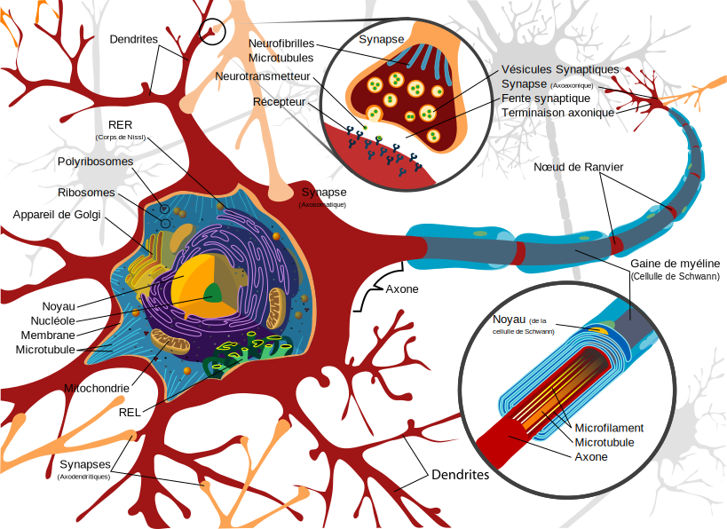

# Chapitre VII: Réseau de neurones artificiels

## Sommaire

[(Retour vers la page principale)](README.md)

- Chapitre VII: Réseau de neurones artificiels
  - [VII-1 Motivation](#vii-1-motivation)
  - [VII-2 Classification](#vii-2-perceptron)
  - [VII-3 Apprentissage](#iv-2-apprentissage)
  - [VII-4 Exemples](#iv-3-exemples)
  - [VII-5 Avantages](#iv-4-avantages)
  - [VII-6 Limites](#iv-5-limites)
  - [VII-7 Un peu de programmation](#iv-6-un-peu-de-programmation)

## VII-1 Motivation

|  |
|:--:|
| *Schéma d'un neurone [ [Wikimedia](https://commons.wikimedia.org/wiki/File:Complete_neuron_cell_diagram_fr.svg?uselang=fr) ]* |

Le cerveau humain est constitué des milliards de cellules parmi laquelles on trouve les neurones.
Un neurone est une cellule constituant l'unité fonctionnelle de base du système nerveux.
Il existe de trois parties importantes (parmi autres):
- Dendrites: ce sont des fibres nerveuses qui ont comme but de transmettre (apporter) les impulsions électriques vers le corps. On peut les considérer comme des entrées.
- Corps (péricaryon, soma): on peut le considérer comme un système de traitement. Il reçoit des impulsions électriques à partir des dendrites. Lorsque la charge électrique dépasse un certain seuil, il émit une impulsion électrique instantanée via son axone. On appel ça le potentiel d'action ou l'influx nerveux.
- Axone: on peut le considérer comme la sortie du neurone. Il transporte le signal électrique vers d'autres neurones (ou vers les muscles ).

## VII-2 Perceptron

## VII-1 Classification

[(Sommaire)](#sommaire)

## Bibliographie

  - https://towardsdatascience.com/perceptron-learning-algorithm-d5db0deab975
  - http://science.sciencemag.org/content/165/3895/780
